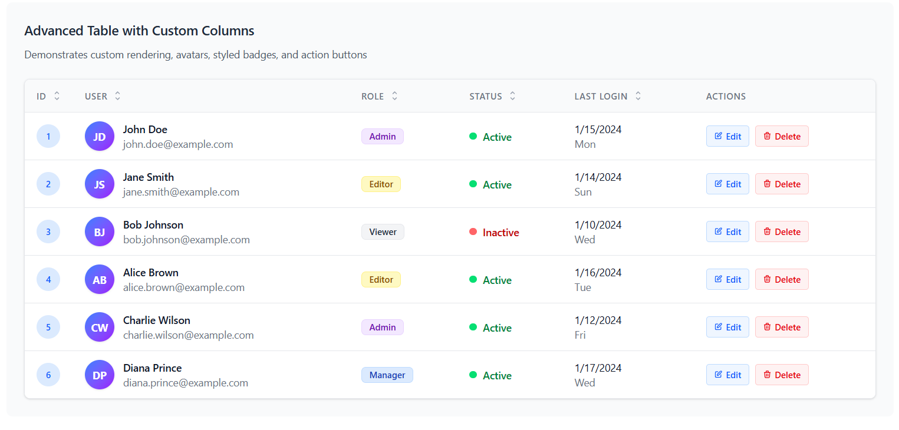
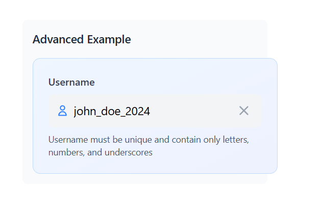
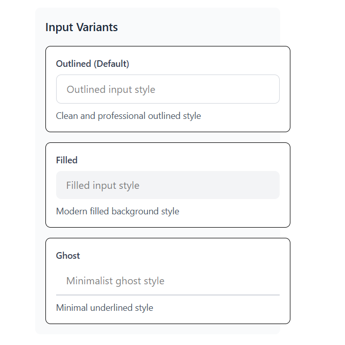
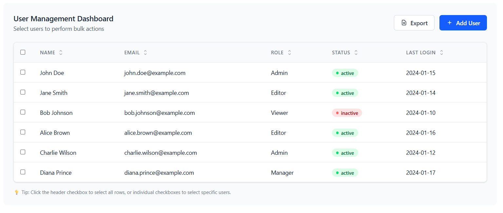

# React Component Library

A modern, accessible React component library built with TypeScript, TailwindCSS, and Storybook.
# React Component Library

A modern, accessible React component library built with TypeScript, TailwindCSS, and Storybook.

## 🚀 Live Demo & Storybook

- **Deployed Storybook (components & docs)**: https://frontend-assignment-inky-eight.vercel.app/
- **Local demo app**: http://localhost:5173/
- **Local Storybook**: http://localhost:6006/

## 📦 Components

### 🎯 InputField
A flexible, accessible input component with multiple variants, sizes and validation states.

### 📊 DataTable
A data table with sorting, selection, loading and empty states. Fully typed with TypeScript generics.

## � Quick Start (PowerShell)

```powershell
# Clone
git clone https://github.com/Kevin1skyrj/Frontend-Assignment.git
cd Frontend-Assignment

# Install
npm install

# Run demo app (Vite)
npm run dev

# Run Storybook locally
npm run storybook

# Run tests once
npx vitest run
```

## 🛠 Build & Deploy

Build Storybook (produces `storybook-static/`):

```powershell
npm run build-storybook
```

Deploy Storybook on Vercel (GUI):

1. Push your repo to GitHub.
2. Go to https://vercel.com/new and import your repository.
3. Set Project Settings:
   - Framework Preset: Other
   - Build Command: `npm run build-storybook`
   - Output Directory: `storybook-static`
4. Deploy — Vercel will provide a public URL.

Optional CLI deploy (deploy built static folder):

```powershell
# build first
npm run build-storybook

# deploy built folder
npx vercel --prod ./storybook-static
```

To deploy the demo app (Vite) instead, set Vercel to the Vite preset or use:

```powershell
npm run build
npx vercel --prod ./dist
```

## ✅ What to review in the deployed Storybook

- InputField: variants (filled, outlined, ghost), sizes, states, clear button, password toggle
- DataTable: column sorting, row selection, loading/empty states, responsive behavior

## 🧪 Tests

```powershell
# Run all tests
npx vitest run

# Run unit tests only
npm run test -- --project unit

# Watch mode
npm run test
```

## 📁 Project structure (short)

```
src/
  components/        # InputField, DataTable
  stories/           # Storybook stories
  App.tsx            # demo app
...
```

## Notes

- The deployed Storybook link above is your Vercel deployment for the Storybook static build.
- If Tailwind styles look wrong in Storybook after deploy, ensure `src/index.css` is imported from `.storybook/preview.*` so Tailwind is bundled into the Storybook build.

---

**Built with ❤️ using React, TypeScript, and TailwindCSS**

---

## 📂 Clear Folder Structure

Top-level layout (important files only):

```
.
├─ .storybook/               # Storybook config
├─ assets/
│  └─ screenshots/           # Put screenshots & GIFs here (README references these)
├─ public/                   # Static assets used by the demo
├─ src/
│  ├─ components/            # Reusable components (InputField, DataTable)
│  ├─ stories/               # Storybook stories
│  ├─ test/                  # Test setup & utils
│  ├─ App.tsx
│  └─ main.tsx
├─ package.json
├─ README.md
└─ vercel.json               # Vercel configuration for Storybook deploy
```

## 🧭 My approach (short)

- Build small, well-typed components first with TypeScript generics where appropriate.
- Keep components accessible by default (ARIA-friendly labels, keyboard support).
- Use TailwindCSS utilities + a simple `cn` helper to compose classNames safely.
- Write unit tests (Vitest + Testing Library) for logic and interaction, and Storybook stories for visual and integration testing.
- Produce a Storybook static build (`storybook-static`) for deployment to static hosts (Vercel/Netlify).


## 🖼 Screenshots

The repository now includes four example screenshots in `assets/screenshots/`. They are embedded below with short captions — these render automatically on GitHub once the images are committed.

### Advanced table with custom columns and actions


Caption: A wide data table showing avatars, role badges, status indicators, last-login dates, and action buttons (Edit/Delete).

### InputField — advanced example


Caption: InputField advanced usage inside a card with helper text, an icon on the left, and a clear (✕) button on the right.

### Input variants (outlined / filled / ghost)


Caption: Three common input visual variants used by the design system: outlined (default), filled, and ghost (underline).

### User management dashboard (table example)


Caption: A management dashboard view using the DataTable component: selectable rows, status badges, and export/add buttons.

